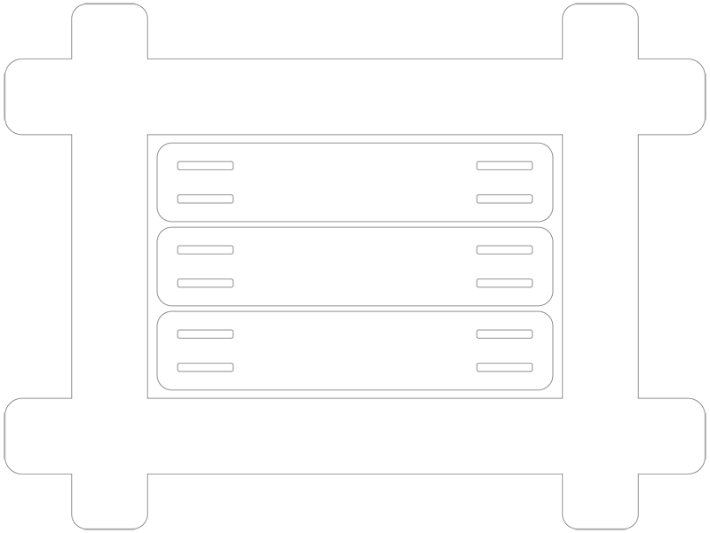

# Sobakode



Stop the spaghetti code and write [soba](https://en.wikipedia.org/wiki/Soba) code

[Sobakode](<https://blog.tolki.dev/sobakode/>)

## Why soba?

I like soba. It tastes good.

I can also use sobako to cook [French galettes](<https://en.wikipedia.org/wiki/Kaletez>) so there's that.

## Using this repo locally

```shell
mkdocs serve
```
